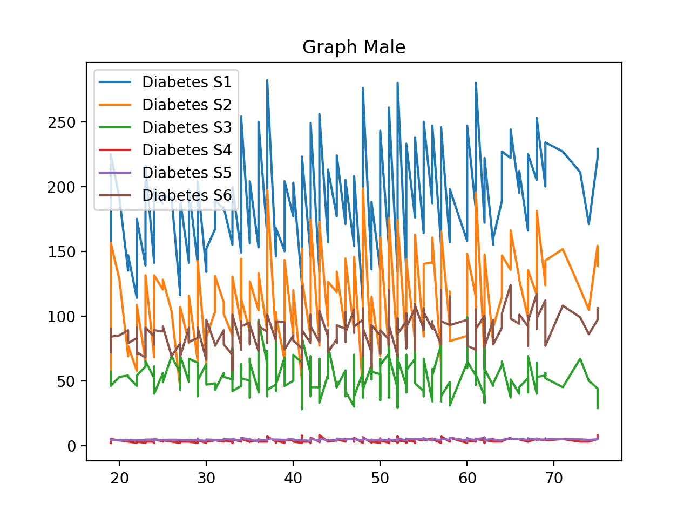
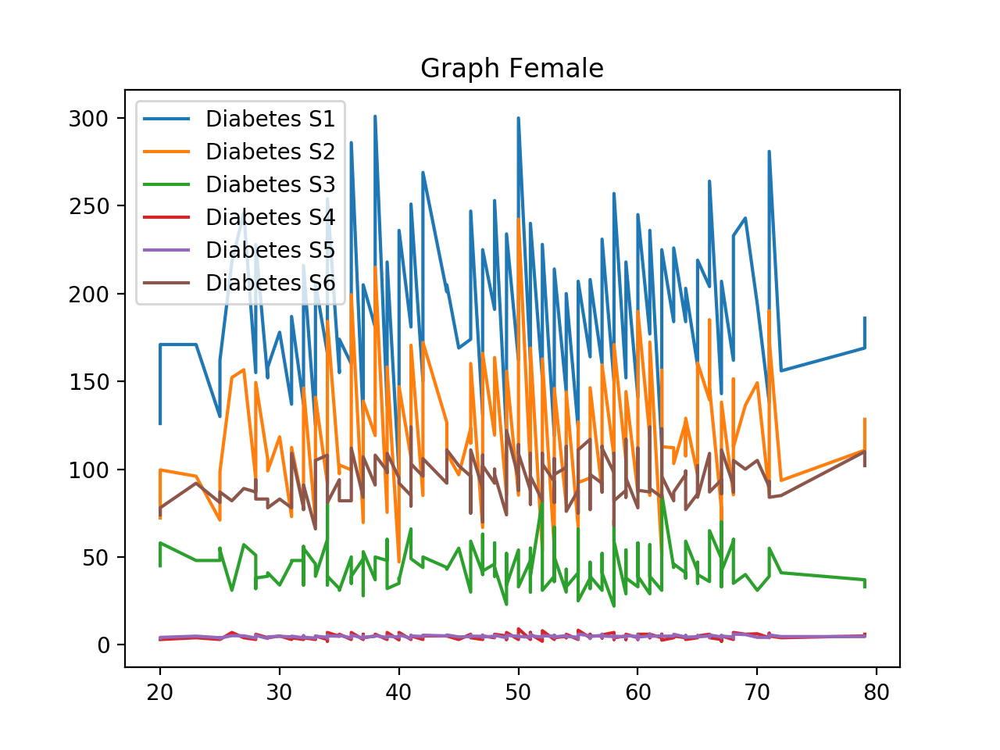
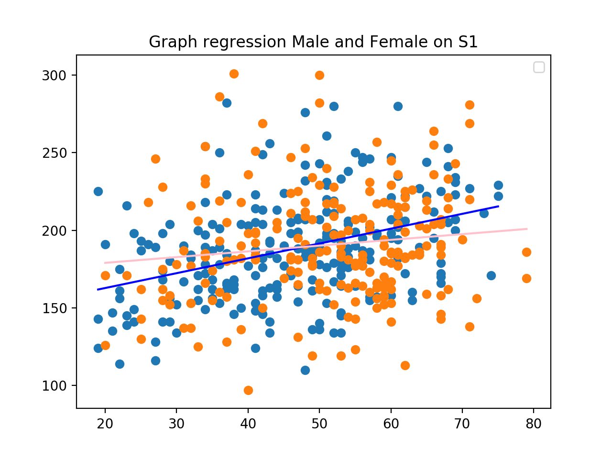
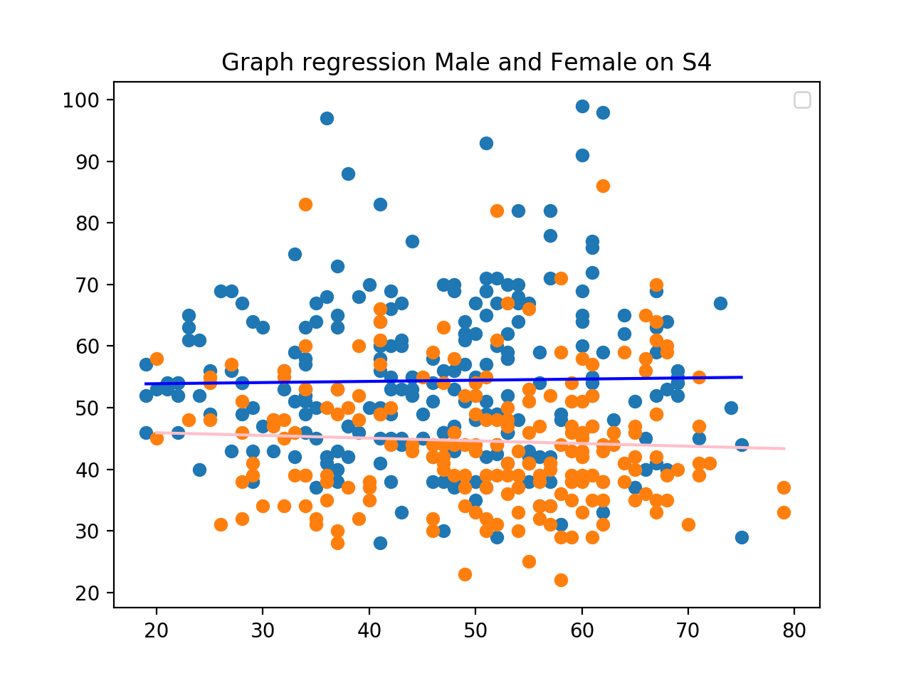
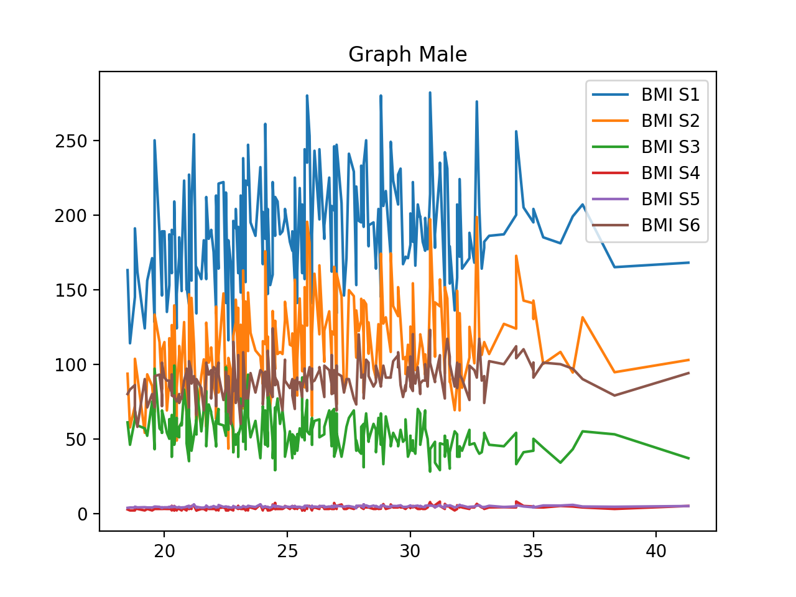
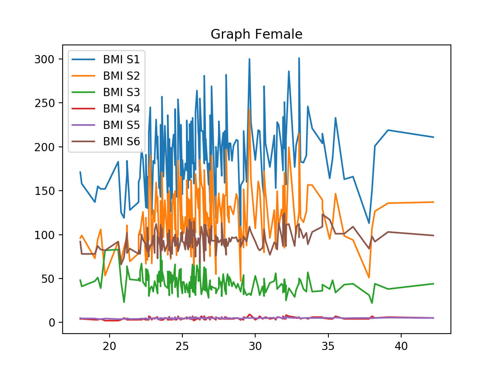
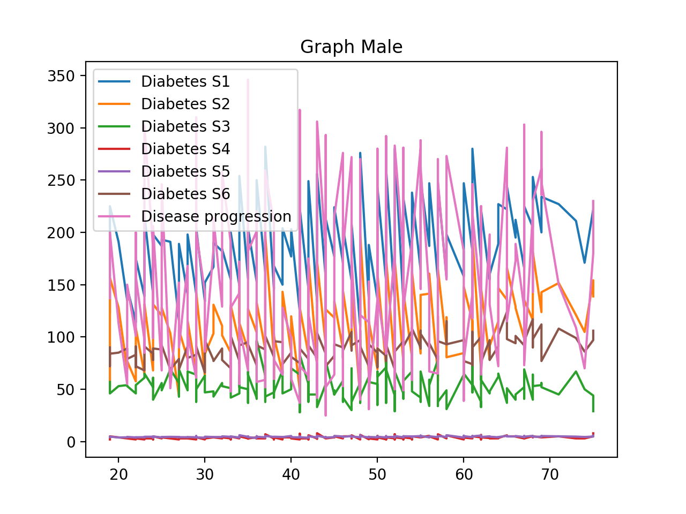
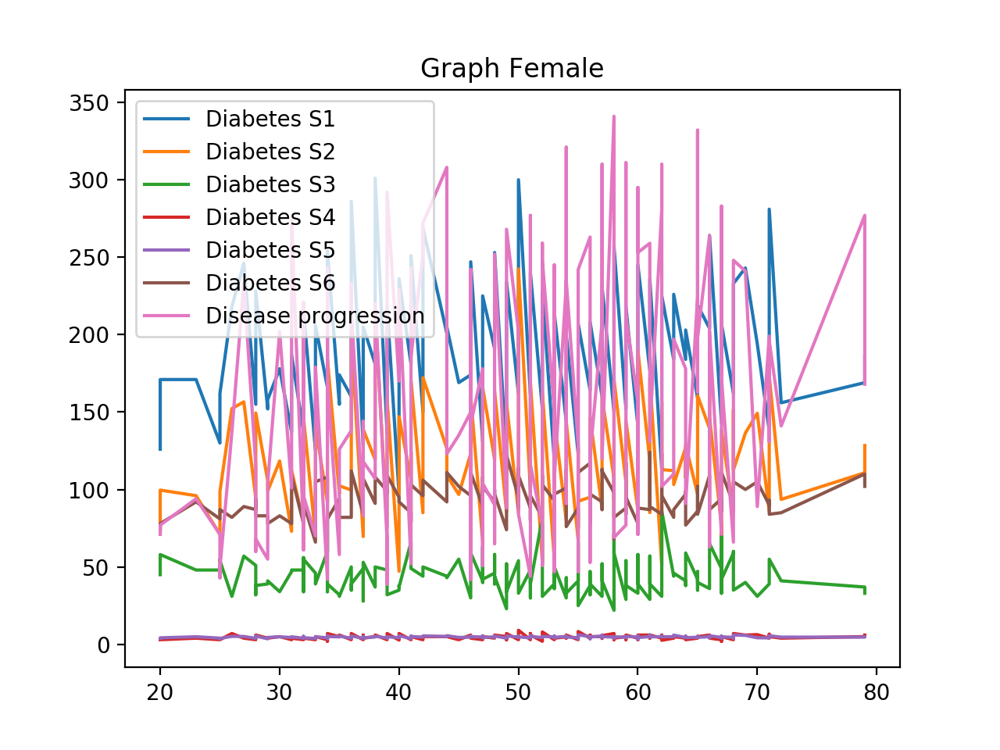

# final_project
CEBD 1160-Final Project
### Research Question
Compute Diagnosis data from patients and observe the disease progression based on different characteristics from the diabetes dataset.

### Introduction

Using the diabetes dataset from the "Least Angle Regression," Annals of Statistics (with discussion), 407-499 of authors Bradley Efron, Trevor Hastie, Iain Johnstone and Robert Tibshirani (2004), we will be analysing a sample of 442 records of diabetes patient. The variables being studied are the age, sex, body mass index, average blood pressure, and six blood serum measurements were obtained for each of the patients.
Throughout this report, we will be drawing a comparison between male and female using  linear regression based on the age and the blood serums.

### Analysis

The first exploration we did was to compare the different blood serums based on the age for the female and male data.

#### Male 

After comparing the different serum samples against the age we were able to obtained the following graphs:

When observing the graph of the male, we can tell that the graph reflects a steady evolution.
We noted that the number of serums slightly increase overtime without an important variation being drawn between them.

#### Female

The female graph displays a similar steadiness between the serums. However, the range between each serum is greater than of the male graph.

The above graph depicts the observations we just mentioned.

#### Linear regression

We did the linear regression on the S1 serum. 
Before the age 50, the numbers are lower for the male , while the female are more important after 50.
For the next graph, the female variation is much lower than the one from the male. 
And the different axes show how the male trend stays flat, while for the female it decreases as they age.

#### Observation on BMI
We have generated the same graph as above using the BMI values instead of the Age ones. 
We noted that the serums evolution was pretty similar for both criteria.
This confirms the hypothesis according to which BMI and Age are almost proportional.
We obtained the following graph that depicts our observation:

####Disease progression after 1 year

It is apparent that for the male, the disease progression has much lower numbers than of the females.

### Conclusion
